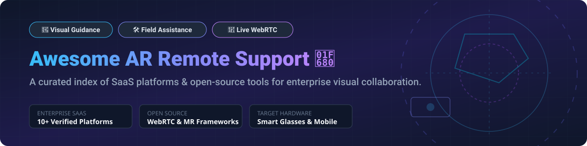

# Awesome Augmented Reality Remote Support 🥽✨

  

  
  
  
  
  
  

---

## 📌 Overview

Welcome to the definitive, curated list of **Augmented Reality (AR) Remote Support**, **Visual Assistance**, and **Mixed Reality Remote Expert Collaboration** solutions! 🚀 

These software platforms and open-source frameworks empower field technicians, maintenance engineers, and frontline workers to connect seamlessly with off-site experts. Remote specialists can view real-time camera streams, overlay 3D spatial annotations, and guide complex industrial, medical, or telecommunications repair operations hands-free.

---

## 💡 Table of Contents
- [📌 Overview](#-overview)
- [📊 SaaS / Hosted Enterprise Platforms](#-saas--hosted-enterprise-platforms)
- [🔓 Open-Source GitHub Repositories](#-open-source-github-repositories)
- [🤝 How to Contribute](#-how-to-contribute)
- [⚠️ Disclaimer & Market Notes](#️-disclaimer--market-notes)
- [❤️ Support & Sponsorship](#️-support--sponsorship)
- [📈 Star History](#-star-history)

---

## 📊 SaaS / Hosted Enterprise Platforms

> 📈 **Market Size & Structure**: The global Augmented Reality in Remote Support and Field Service market size is estimated at **$2.4 Billion USD** (2025/2026) and is projected to reach **$11.8 Billion USD by 2030** (CAGR ~37.5%). The market is **moderately fragmented**, featuring a mix of large enterprise industrial software giants (PTC, TeamViewer, Xerox) and specialized visual assistance pioneers (Help Lightning, SightCall). 

| SaaS Product 🛠️ | Enterprise Scale & Valuation 🏢 | Starting Tier Pricing 💵 | Free Tier / Trial Limit ⏳ | Key Capabilities & Highlights 🌟 |
| :--- | :--- | :--- | :--- | :--- |
| **[PTC Vuforia Chalk](https://www.ptc.com/en/products/vuforia/vuforia-chalk)** 🎨 | **$17.26 Billion** (Market Cap) | **$65 / user / month** (billed annually) | **30-day Enterprise Evaluation Trial** (full features) | **3D Spatial Annotations**: Digital drawings lock in 3D space on physical objects. Proven across 30+ Henkel factories. |
| **[TeamViewer Frontline](https://www.teamviewer.com/en-cis/products/frontline/)** 👓 | **$1.10 Billion** (Market Cap) / $876M ARR | **$1,428 / year** ($119 / user / month base) | **14-day Commercial Free Trial** (Frontline Assist) | **Enterprise AR Platform**: Vision picking, assembly & remote guidance. Used by DHL, Coca-Cola HBC, and Samsung SDS. |
| **[CareAR (Xerox)](https://www.carear.com/)** 📐 | **$700 Million** (Valuation) / $23.5M ARR | **$45 / user / month** | **30-day Free Trial** | **AR Measurement & CRM Integrations**: Integrated with ServiceNow & Salesforce, features AR distance measuring & image freeze mode. |
| **[SightCall VISION](https://sightcall.com/platform/)** 👁️ | **$175 Million** (Est. Valuation) / $54M+ Raised | **$39 / user / month** | **14-day Enterprise Free Trial** | **AI-Powered Visual Service**: Video support with visual AI recognition, Xpert Knowledge tutorials, SOC2 Type II & HIPAA compliant. |
| **[RealWear Cloud](https://www.realwear.com/)** 🥽 | **$120 Million** (Est. Valuation) / $115M Raised | **$180 / device / year** ($15 / month base) | **30-day Free Tier** (RealWear Cloud Essentials) | **Assisted Reality Wearables**: Hands-free micro-display hardware & cloud management ecosystem for industrial frontline work. |
| **[Librestream Onsight](https://librestream.com/)** 🛡️ | **$55 Million** (Total Funding) / $12.5M ARR | **$40 / user / month** | **14-day Managed Demonstration Trial** | **Mission-Critical Security**: Built for ultra-secure environments (Raytheon case study with 30% travel cost reduction). |
| **[Help Lightning](https://helplightning.com/)** ⚡ | **$36.8 Million** (Valuation) / $12.7M Raised | **$35 / user / month** | **14-day Free Trial** (No credit card / web browser join) | **Patented Merged Reality**: Merges expert hand video into field worker view. IntelliAssist AI & voice transcripts included. |
| **[Scope AR WorkLink](https://www.scopear.com/)** 📦 | **$33.7 Million** (Acquired by Flatirons) | **$50 / user / month** | **14-day Enterprise Free Trial** | **3D AR Work Instructions**: Step-by-step 3D equipment procedures integrated with live remote expert calling. |
| **[Atheer Lens](https://play.google.com/store/apps/details?id=com.atheer.lens)** 📱 | **$32.7 Million** (Total Funding) / $14.6M ARR | **$30 / user / month** | **14-day Free Trial** | **Frontline Operations**: No-code AR work instruction builder, multi-party video calls, and group message collaboration. |

---

## 🔓 Open-Source GitHub Repositories

> 💡 *Note: Open-source solutions in AR remote support provide foundational WebRTC streaming, facial/spatial tracking, and wearable device integration for custom research and self-hosted development.*

| Repository & Link 📦 | GitHub Star Count ⭐ | License 📜 | Focus Area & Technical Highlights 🚀 |
| :--- | :--- | :--- | :--- |
| **[AR.js-org/AR.js](https://github.com/AR-js-org/AR.js)** 🌐 |  | MIT | **WebAR Framework**: Efficient 60fps marker-based and location-based AR running in standard mobile browsers with WebGL/WebRTC. |
| **[BasedHardware/OpenGlass](https://github.com/BasedHardware/OpenGlass)** 🕶️ |  | MIT | **Wearable AI & Visual Assistant**: Turn any glasses into AI smart glasses for real-time visual perception and remote expert logging. |
| **[jeeliz/jeelizFaceFilter](https://github.com/jeeliz/jeelizFaceFilter)** 🎭 |  | Apache-2.0 | **Face Tracking Engine**: Lightweight WebGL WebRTC face tracking for real-time video filter overlays and privacy masking. |
| **[skydoves/Pokedex-AR](https://github.com/skydoves/Pokedex-AR)** 📲 |  | Apache-2.0 | **Mobile AR Reference Architecture**: Clean architecture implementation of ARCore and Sceneform for 3D model overlays. |
| **[dalkofjac/webrtc-tutorials](https://github.com/dalkofjac/webrtc-tutorials)** 💻 |  | MIT | **Smart Glasses Remote Assistant**: Android smart glass remote assistance tutorial suite targeting Vuzix M400 & Google Glass with WebRTC. |
| **[RTC-MR Framework](https://github.com/)** 🏥 |  | Academic | **Mixed Reality Communication**: WebRTC-based MR framework with node-dss signaling, validated in Health-5G emergency medical pilot. |

---

## 🤝 How to Contribute

Contributions are highly encouraged! To add or update an entry:

1. 🍴 **Fork** the repository.
2. 📝 Add or modify entries in `README.md` following the table schema.
3. 🔎 Ensure all company figures, pricing, and GitHub star links are accurate and factual.
4. 📬 Submit a **Pull Request** with a clear title and description.

---

## ⚠️ Disclaimer & Market Notes

* ℹ️ **Community Curated**: This repository is a community-maintained curated resource list for informative purposes.
* 🔒 **Data Protection**: AR remote support software records audio, video, and spatial environment data. Compliance with HIPAA, GDPR, and SOC 2 standards should be verified prior to enterprise deployment.
* 📢 **Lifecycle Notice**: **Microsoft Dynamics 365 Remote Assist** and **Dynamics 365 Guides** reach **End of Support on December 31, 2026**. New subscriptions closed on **November 1, 2025**. Organizations using Dynamics 365 should transition to alternative platforms listed above.

---

## ❤️ Support & Sponsorship

If you find this repository helpful for your research, team, or project, please consider supporting it! 🌟

- ⭐ **Star this repository** to help others discover it!
- 🔀 **Fork & Share** it with colleagues and the AR/Spatial Computing community.
- ☕ **Buy me a coffee**: Support ongoing open-source curation via [GitHub Sponsors](https://github.com/sponsors/ishandutta2007)!

  

---

## 📈 Star History

